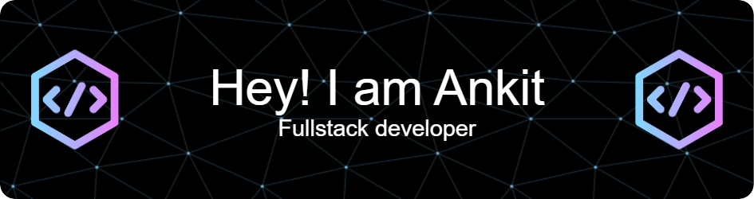

<h1 align="center">👋 Hi, I'm Ankit Kumar</h1> 

<h3 align="center"><b>Welcome to my GitHub profile!</b></h3>

🚀 I'm a Full-Stack Developer passionate about building high-quality applications and constantly learning new technologies. 
Check out my projects and contributions below!

  

---

## 🚀 About Me

- 🔭 I’m currently working on **enhancing my full stack skills**  
- 🌱 I’m currently learning **ReactJS** ⚛️  
- 🤝 I’m looking to collaborate on **exciting and innovative projects**  
- 💬 Ask me about **Front-End Web Development, JavaScript, and MERN Stack**  
- 📫 Reach me at **ankit.singh28112011@gmail.com**  

---

## 🛠 Tech Stack

 
 
 
 
 
 
 
 
 

---

## 📊 GitHub Stats

    
    
  

---

## 🤝 Connect with Me

  
  
  

---

  <i>Thanks for visiting my profile! Let’s build something amazing together 🚀</i>

